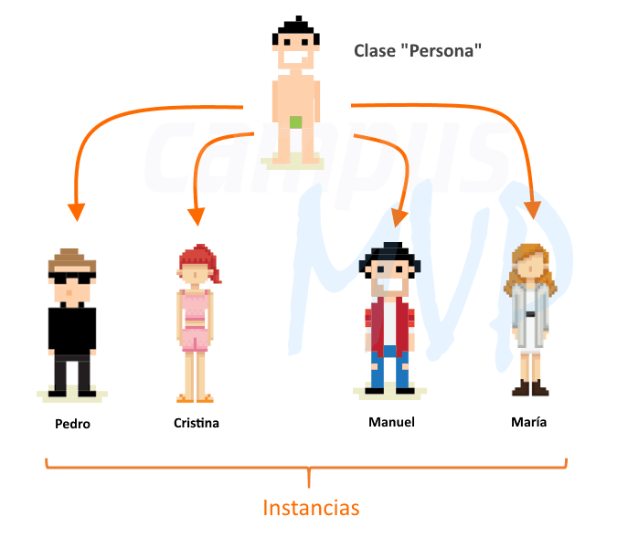

# Módulo 1: Fundamentos de Programación

## 1.1 Introducción a la Programación

### Variables, tipos de datos y operadores

#### Variables: 
Una **variable** es un espacio en memoria donde podemos almacenar un valor que luego podremos modificar o utilizar en nuestro programa.

```csharp
int edad = 25;
string nombre = "Rodolfo";
bool esEstudiante = true;
```
En el ejemplo anterior podemos apreciar **3** variables que son:
- `edad` que tiene el valor `25`
- `nombre` que tiene el valor `Rodolfo`
- `esEstudiante` que tiene el valor `true`

#### Tipos de datos
En C#, como en casi todos los lenguajes de programación, tenemos varios tipos de datos que podemos usar para especificar el tipo de valor que queremos asignar a una variables, entre ellos los más comunes son:

```csharp
// 'int' o 'entero' es un tipo de dato numérico entero, es decir, sin decimales.
// Los usamos normalmente para contar cantidades o unidades. Lo utilizamos así:

int edad = 25;
int hijos = 3;
int diasDeVacaciones = 15;
int alturaEnCentimetros = 180;
```

```csharp
// 'double' o 'decimal' es un tipo de dato numérico con decimales.
// Los usamos normalmente para llevar control de datos numéricos precisos. Lo utilizamos así:

double nota = 3.5;
double kilos = 10.75;
decimal saldoEnLaCuenta = 585000.50;
decimal numeroPI = 3.141592;
```

```csharp
// 'string' es un tipo de dato que representa un texto o 'caracteres'.
// Los usamos normalmente para nombrar cosas, tales como: nombres, apellidos, direcciones, marcas, identificación, etc. Lo utilizamos así:

string nombre = "Ramiro";
string apellido = "González";
string direccion = "Calle 1 # 4 - 25 Barrio Alfonso López";
string numeroDeCedula = "10856789012";
```

```csharp
// 'bool' es un tipo de dato que representa un valor lógico, es decir, verdadero o falso.
// Los usamos normalmente para expresar una condición o para saber si se cumple o no se cumple con algo. Lo utilizamos así:

bool tieneHijos = false;
bool esMayorDeEdad = true;
bool tieneEmailVerificado = false;
bool esAdministrador = true;
```

#### Operadores
Los operadores son símbolos que nos permiten hacer **operaciones matemáticas**, **operaciones lógicas** o **comparaciones**.

```csharp
// Los operadores matemáticos son los más conocidos incluso fuera de la programación.
// Son los siguientes: +, -, *, /, %

int suma = 1 + 2;
// Resultado: 3

int resta = 2 - 1;
// Resultado: 1

int multiplicacion = 2 * 3;
// Resultado: 6

int division = 20 / 4;
// Resultado: 5

int residuo = 5 % 2;
// Resultado: 1
```

```csharp
// Los operadores lógicos son menos conocidos, se basan en Álgebra de Boole.
// Son los siguientes: &&, ||, !

// El operador 'Y' o '&&' cumple con las siguientes condiciones: Su resultado es verdadero si ambos son verdaderos.
bool operadorY = true && true;
// Resultado: true

// El operador 'O' o '||' cumple con las siguientes condiciones: Su resultado es verdadero si alguno de los dos es verdadero.
bool operadorO = true || true;
// Resultado: true

// El operador 'NO' o '!' cumple con las siguientes condiciones: Cambia entre verdadero y falso.
bool operadorNegacion = !true;
// Resultado: false;
```

```csharp
// Los comparadores sirven para tomar decisiones o saber si algo cumple o no una condición.
// Son los siguientes: ==, !=, <, >, <=, >=

// El operador 'igual' o '==' indica si dos valores son iguales.
bool operadorIgual = 1 == 1;
// Resultado: true

// El operador 'diferente' o '!=' indica si dos valores son diferentes.
bool operadorIgual = 1 != 1;
// Resultado: false

// El operador 'menor que' o '<' indica si un valor es menor a otro.
bool operadorIgual = 1 < 1;
// Resultado: false

// El operador 'mayor que' o '>' indica si un valor es mayor a otro.
bool operadorIgual = 1 > 1;
// Resultado: false

// El operador 'menor o igual que' o '<=' indica si un valor es menor o igual a otro.
bool operadorIgual = 1 <= 1;
// Resultado: true

// El operador 'mayor o igual que' o '>=' indica si un valor es mayor o igual a otro.
bool operadorIgual = 1 >= 1;
// Resultado: true
```

### Estructuras de control (if, switch, bucles)

#### Condicionales (if-else)
Permiten ejecutar un código cuando se cumple una condición, para ello nos ayudaremos de las variables **bool** y de los **operadores lógicos**.

```csharp
// Podemos usar operadores de comparación para decidir si ejecutamos o no un código
int edad = 25;

if (edad >= 18)
{
    // Es mayor de edad
}
else
{
    // Es menor de edad   
}

// También podemos usar directamente una variable de tipo bool:
bool esAdministrador = false;

if (esAdministrador)
{
    // Permitir cualquier acción
}
else
{
    // Restringir acceso
}

// Incluso podemos hacer combinaciones de variables tipo bool y operadores lógicos
bool tieneCorreoVerificado = false;

if (!tieneCorreoVerificado)
{
    // Verifique su correo antes de continuar e intente de nuevo
}
else
{
    // Permitir acceso a la página
}
```

#### Switch
Permiten seleccionar una opción entre varias opciones, es similar al 'if' pero en este caso tenemos cualquier número de opciones

```csharp
// La estructura switch permite validar si una variable tiene un valor específico:
int dia = 3;

switch (dia)
{
    case 1:
        // Lunes
        break;
    case 2:
        // Martes
        break;
    case 3:
        // Miércoles
        break;
    case 4:
        // Jueves
        break;
    case 5:
        // Viernes
        break;
    case 6:
        // Sábado
        break;
    case 7:
        // Domingo
        break;
    default:
        // Día no válido
        break;
}
```

#### Bucles
Permiten ejecutar un bloque de código `x` cantidad de veces, esto nos ayuda cuando requerimos repetir un proceso varias veces.
Algunos casos donde podemos usarlo es cuando queremos registrar múltiples datos queremos reintentar un proceso.
En los lenguajes de programación tenemos normalmente 4 estructuras conocidas que son:

##### For
Este bucle normalmente lo usamos cuando conocemos de antemano cuántas veces queremos ejecutar un bloque de código.
```csharp
for (int i = 0; i < 3; i++)
{
    Console.WriteLine(i);
}
// Resultado:
// 0
// 1
// 2
```

##### Foreach
Este bucle normalmente lo usamos cuando queremos recorrer una lista de objetos y ejecutar una porción de código por cada elemento de la lista.
```csharp
List<int> numeros = [ 0, 1, 1, 2, 3, 5, 8, 13 ];
foreach (int elemento in numeros)
{
    Console.Write($"{elemento} ");
}
// Resultado: 0 1 1 2 3 5 8 13
```

##### While
Este bucle normalmente lo usamos cuando conocemos queremos ejecutar una porción de código hasta que se cumpla una condición y no conocemos de antemano cuántas veces camos a ejecutarlo.
```csharp
int numero = 0;
while (numero < 5)
{
    Console.Write(numero);
    numero++;
}
// Resultado: 01234
```

##### Do
Este bucle es similar con el bucle `while`, la única diferencia es que primero ejecutamos el bloque de código y luego evaluamos la condición, lo que resulta en que mientras el `while` podría no ejecutarse una sola vez, el `do` siempre se ejecutará mínimo una vez.
```csharp
int numero = 0;
do
{
    Console.Write(numero);
    numero++;
} while (numero < 5);
// Resultado: 01234
```

### Funciones/métodos
Las funciones/métodos son formas de encapsular o aislar un bloque de código, normalmente lo usamos cuando queremos usar la misma porción de código en dos lugares distintos. Este concepto de funciones o métodos, nos permiten a no escribir el mismo código múltiples veces, sino poder utilizarlo donde lo necesitemos.

Nota: Otro uso que tienen las funciones o métodos, es hacer que nuestro código sea más fácil de leer y de darle mantenimiento.

Dentro de las funciones y métodos tenemos dos tipos que son, las funciones que no retornan ningún valor, y las funciones que sí retornan un valor:

```csharp
// Esta es una función sencilla que nos permite sumar dos números enteros
public int Sumar(int a, int b)
{
    return a + b;
}

// Para hacer uso de esta función debemos "llamarla" y asignamos su valor a una variable
int resultado = Sumar(1, 2);

Console.WriteLine(resultado);
// Resultado: 3
```

```csharp
// Esta es una función sencilla que nos permite mostrar por pantalla un mensaje
public void MostrarMensaje()
{
    Console.WriteLine("Este es un mensaje.");
}

// Como la función no retorna ningún valor, no podemos asignarla a ninguna variable
MostrarMensaje();

// Resultado: Este es un mensaje.
```

## 1.2 Programación Orientada a Objetos (POO)
La programación orientada a objetos es una forma de escribir código, a esto se le conoce como *paradigma* de programación. Los dos *paradigmas* más utilizados son **Programación Orientada a Objetos** y **Programación Estructurada**, la diferencia radica en que mientras que la **Programación Estructurada** se centra en resolver los problemas usando únicamente *funciones o procedimientos*, la **Programación Orientada a Objetos** hace uso de otros conceptos que veremos a continuación.

> Nota: En este curso nos enfocaremos principalmente en este último paradigma.

La **Programación Orientada a Objetos** se basa en un concepto de **objetos**, y con esto busca que creemos nuestro código como si interactuáramos con objetos del mundo real, es decir, estos "objetos" pueden interactuar, tiene sus propiedades, ejecutan acciones, tienen ciertas capacidades, toman decisiones, etc.

> Nota: La programación orientada a objetos tiene 4 pilares: encapsulamiento, herencia, polimorfismo y abstracción.

```csharp
// Diferencia entre programación estructural y programación orientada a objetos

// Programación estructural:
public string Saludar(string nombre)
{
    return "Hola, " + nombre;
}

// Programación orientada a objetos:
public class Persona
{
    public string Nombre { get; set; }

    public void Saludar()
    {
        Console.WriteLine("Hola, mi nombre es " + Nombre);
    }
}
```
En el anterior ejemplo podemos ver que la diferencia principal radica en que mientras que en la programación estructurada tenemos una función que "Saluda", en la programación orientada a objetos, tenemos a una "Persona" que saluda.

### Clases y objetos
El primer concepto o el concepto central de la *POO* son los *objetos*, intimamente relacionado a este concepto, está el concepto de *clases*.
Las clases son "plantillas" o "planos" para crear un objeto, mientras que los objetos son "instancias" de las clases, es decir, entidades concretas.

En la siguiente imagen podemos ver una *clase* **Persona** con cuatro *objetos* (instancias) diferentes:


En C# una clase se define usando un nombre, esta clase puede contener una o más propiedades:
```csharp
// Definición de la clase
public class Persona
{
    // Propiedad
    public string Nombre { get; set; }
}
```

Un *objeto* se crea instanciando la clase, al momento de crear un *objeto* se usa la palabra clase **new**:
```csharp
Persona pedro = new Persona();

// Uso de las propiedades
Console.WriteLine(pedro.Nombre);

/* Los objetos también pueden inicializarse de las siguientes formas: */

// Usando la palabra reservada 'var' para ocultar el tipo de objeto, esto es posible si el tipo de datos puede inferirse en la misma línea
var cristina = new Persona();

// Al usar el tipo de objeto, si escribimos la palabra reservada 'new', el compilador infiere qué clase queremos instanciar
Persona manuel = new();

// Al crear un objeto, podemos también inicializar un objeto, los '()' no son necesarios
var maria = new Persona
{
    Nombre = "María"
};
```

### Modificadores o niveles de acceso
Los modificadores de acceso nos indican si podemos acceder a una propiedad, método o clase específica desde otra parte del programa.

#### Public
Es el nivel de acceso más permisisvo, nos permite acceder desde cualquier parte del programa

```csharp
public class Persona
{
    public string Nombre { get; set; }

    // Constructor: Método que se ejecutará cuando usemos la palabra new
    public Persona()
    {
        Nombre = "Ramiro";
    }

    public void Saludar()
    {
        Console.WriteLine($"Hola, mi nombre es {Nombre}");        
    }
}

// Podemos acceder tanto a la clase
var persona = new Persona();

// Como a sus propiedades
Console.WriteLine(persona.Nombre);
// Resultado: Ramiro

// Como a sus métodos
persona.Saludar();
// Resultado: Hola, mi nombre es Ramiro
```

#### Internal
Se comporta similar al modificador `public`, la diferencia radica en que el modificador `internal` solo permite acceso a los elementos desde la misma 'librería'. Este nivel de acceso no lo usaremos mucho en esta guía.


```csharp
/* Código de una librería externa */

namespace libreria;

internal class Persona
{
}

.
.
.

/* Mi código */

// Importamos la librería
using libreria;

namespace mi.codigo;

// Esto lanzará un error indicándonos que no se puede usar esta clase
var persona = new Persona();
```

> Nota: Este modificador de acceso normalmente se usa cuando queremos publicar nuestras propias librerías para que las consuman otros proyectos.

#### Private
Este modificador se acceso se usa para limitar el acceso únicamente desde dentro de la misma clase

```csharp
public class Persona
{
    private string Nombre { get; set; }

    public Persona()
    {
        Nombre = "Ramiro";
    }

    public void Saludar()
    {
        Console.WriteLine($"Hola, mi nombre es {Nombre}");        
    }
}

var persona = new Persona();

persona.Saludar();
// Resultado: Hola, mi nombre es Ramiro

// Esto lanzará un error indicándonos que no se puede usar esta propiedad
Console.WriteLine(persona.Nombre);
```

#### Protected
Este modificador de acceso es similar al modificador `private` con la diferencia que en este caso podemos acceder también desde clases que 'heredan' o derivan desde donde se define

```csharp
public class Persona
{
    protected string Nombre { get; set; }

    protected Persona()
    {
        Nombre = "Ramiro";
    }

    public void Saludar()
    {
        Console.WriteLine($"Hola, mi nombre es {Nombre}");
    }
}

// Clase que hereda o deriva de la clase 'Persona'
public class Empleado : Persona
{
    public Empleado()
    {
    }
}

var empleado = new Empleado();

empleado.Saludar();
// Resultado: Hola, mi nombre es Ramiro

// Esto lanzará un error indicándonos que no se puede usar esta propiedad
Console.WriteLine(persona.Nombre);
```

### Encapsulamiento, herencia y polimorfismo

#### Encapsulamiento
Este concepto hace referencia a la capacidad que tienen los objetos de ocultar/mostrar sus propiedades y métodos.

```csharp
public class Persona
{
    // Propiedad privada, nadie más puede verla
    private string _nombre;

    // Propiedad pública, todos pueden verla
    public string Nombre { get => _nombre; set => _nombre.Value };

    // Propiedad de solo lectura
    public int Edad { get; }

    // Propiedad que solo puede modificarse desde la misma clase
    public int Apellidos { get; private set; }

    public Persona()
    {
        Nombre = "Ramiro";
        Edad = 25;
        Apellidos = "González";
    }

    public void ModificarApellidos(string valor)
    {
        Apellidos = valor;
    }
}

var persona = new Persona();

persona._nombre = "Pablo";
// Error: No se puede acceder a esta propiedad

Console.WriteLine(persona._nombre);
// Error: No se puede acceder a esta propiedad

persona.Nombre = "Eduardo";
// Ok

Console.WriteLine(persona.Nombre);
// Resultado: Eduardo

persona.Edad = 20;
// Error: Esta propiedad es de solo lectura

Console.WriteLine(persona.Edad);
// Resultado: 25

persona.Apellidos = "López";
// Error: Esta propiedad no puede modificarse

Console.WriteLine(persona.Apellidos);
// Resultado: González

persona.ModificarApellidos("Arias");
Console.WriteLine(persona.Apellidos);
// Resultado: Arias
```

### Herencia y Polimorfismo
La herencia en POO es la capacidad de crear una nueva clase (hija) a partir de una clase base (padre). La herencia se usa para compartir propiedades y comportamientos entre clases.

```csharp
public class Animal
{
    public string Especie { get; set; }
    public void EmitirSonido()
    {
        Console.WriteLine($"Emitiendo sonido...");
    }
}

// En C# para indicar herencia, usamos los dos puntos (:)
public class Perro : Animal
{
}

var perro = new Perro
{
    Especie = "Caninos"    
};

Console.WriteLine(perro.Especie);
// Resultado: Caninos
perro.EmitirSonido();
// Resultado: Emitiendo sonido...
```

Como podemos observar en el ejemplo, un `Perro` 'hereda' de `Animal`, es decir, `Perro` es la **clase hija** y `Animal` es la **clase padre**. Podemos decir entonces que `Perro` tiene todas las propiedades y métodos de `Animal`.

El polimorfismo por su parte está relacionado con la herencia, se puede decir que es la capacidad de crear diferentes objetos a partir de una clase base, donde cada objeto tiene una diferente implementación. Esto podemos entenderlo cuando usamos **interfaces y clases abstractas**.

### Interfaces y clases abstractas
#### Interfaces:
Hacen referencia a un contrato que pueden implementar o cumplir ciertas clases, es decir, una interfaz es una forma de "obligar" a una clase que cumpla con cierta estructura y funcionalidad.

Una interfaz se define de la siguiente manera:

```csharp
public interface IPersona
{
    string RazonSocial { get; set; }

    // Se declara el método, pero no se implementa
    void Saludar();
}
```

Una interfaz se implementa de la siguiente manera:

```csharp
// Una persona natural cumple con el contrato de 'IPersona'
public class PersonaNatural : IPersona
{
    // La clase debe [obligatoriamente] tener esta propiedad
    public string RazonSocial { get; set; }

    // La clase debe [obligatoriamente] tener este método
    public void Saludar()
    {
        Console.WriteLine($"Hola, mi nombre es {RazonSocial}");
    }
}

// Una persona jurídica también cumple con el contrato de 'IPersona'
public class PersonaJuridica : IPersona
{
    // La clase debe [obligatoriamente] tener esta propiedad
    public string RazonSocial { get; set; }

    // La clase debe [obligatoriamente] tener este método
    public void Saludar()
    {
        Console.WriteLine($"Hola, soy la persona jurídica: {RazonSocial}");
    }
}
```

#### Clases abstractas:
El uso de las clases abstractas es bastante parecido a las interfaces, incluso, en algunos casos, se puede usar de manera indiferente una interfaz o una clase abstracta.

Es similar a una clase normal, con una diferencia importante: Una clase abstracta no puede ser instanciada, es decir, no puedo crear objetos a partir de ella.


```csharp
public abstract class Persona
{
    public string RazonSocial { get; set; }

    public void Saludar()
    {
        Console.WriteLine($"Hola, mi nombre es {RazonSocial}");
    }
}

// No es posible hacer esto: var persona = new Persona();
```

##### ¿Cómo y cuándo usar una clase abstracta?
Una clase abstracta se usa cuando queremos utilizar lógica compartida entre varias clases, ejemplo:

```csharp
// Ambas clases comparten la propiedad 'RazonSocial' e implementan de manera idéntica el método 'Saludar'

public class PersonaNatural : Persona
{
}

public class PersonaJuridica : Persona
{
}
```

##### Operadores:
* abstract

```csharp
// Se usa cuando queremos obligar a que las clases deban crear una implementación obligatoriamente:
public abstract class Persona
{
    public string RazonSocial { get; set; }
    public abstract void Saludar();
}

public class PersonaNatural : Persona
{
    // Este método debe crearse obligatoriamente
    public void Saludar()
    {
        Console.WriteLine($"Hola, mi nombre es {RazonSocial}");
    }
}
```
* new
```csharp
// Se usa cuando queremos crear nuestra propia implementación y no usar la de la clase abstracta:
public class PersonaNatural : Persona
{
    public new void Saludar()
    {
        Console.WriteLine($"Esta es una nueva implementación");
    }
}

var personaNatural = new PersonaNatural();
personaNatural.Saludar();
// Resultado: Esta es una nueva implementación
```

* virtual-override

```csharp
// Se usa cuando queremos dejar una implementación en nuestra clase abstracta para que se pueda sobreescribir más adelante si se quiere:
public abstract class Persona
{
    public virtual void Saludar()
    {
        Console.WriteLine($"Esta la implementación original");
    }
}

public class PersonaNatural : Persona
{
    public override void Saludar()
    {
        Console.WriteLine($"Esta es la implementación sobreescrita");
    }
}

public class PersonaJuridica : Persona
{
}

var personaNatural = new PersonaNatural();
personaNatural.Saludar();
// Resultado: Esta es la implementación sobreescrita

var personaJuridica = new PersonaJuridica();
personaJuridica.Saludar();
// Resultado: Esta la implementación original
```